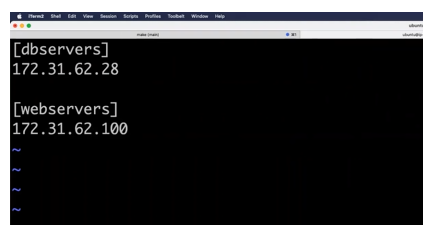
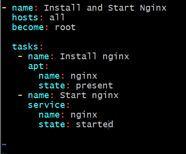

## Ansible Playbooks

With Ansible playbooks, you can define a series of steps, called tasks, that should be performed on target machines. These tasks can range from installing software, configuring settings, managing files, and even running complex operations.

## Ansible Adhoc Commands

In simple words, Ansible ad-hoc commands are quick, one-line instructions that you can use to perform simple tasks on remote computers or devices without writing a complete playbook. With Ansible ad-hoc commands, you can execute common tasks such as checking system information, installing packages, restarting services, or copying files, among others. They are especially useful for performing quick actions on multiple machines simultaneously, without the need for more complex configuration or organization.

---

> To run Ansible Adhoc commands

use this command:

to create a simple file in the target server using the host server (dev-ec2)

If we have multiple ip addresses we can group them in a inventory file and then provide the name of the group

Inventory File = simply stores Ip addresses of the target servers

ansible -i inventory_file_location ip_address_of_the_target_server or use all (it will add the ip address of all the target servers mentioned in inventory file)

like this: ansible -i inventory_file_location all -m "module" -a "touch testfile"
-m = module, here "shell" (using shell we can create a file) is a module that you can refer from ansible modules official docs : https://docs.ansible.com/ansible/2.9/modules/list_of_all_modules.html
-a = -a stands for what is the command that we want to execute like touch we used we can change that as well
like: ansible -i inventory_file_location all -m "module" -a "df"
output will be disk usage

eg: ansible -i inventory all -m "shell" -a "touch devopsclass" -> this will create a devopsclass file in target server

If you want to perform some other operation just refer the official ansible modules doc. Search copy on docs if you want to copy from 1 server to another. And then just replace the module from shell to copy. and add the arguments as given after -a argument.

Suppose if we have multiple target servers one are related to databaseservers and another is related to webservers. So if there is a use case that certain number of config or playbooks we want to run for databaseservers and some for webservers. In order to do this we have to do grouping of servers in inventory file like this

[dbservers]
ip addresses

[webservers]
ip addresses

the command would be like this:

instead of all it should be the group name. It will perform on the servers within that group.

ansible -i inventory_file_location webservers -m "module" -a "touch testfile"

For performing these simple task on a target server we use ansible adhoc commands, for performing a set of tasks or operations we create ansible playbooks.

---

> How to write ansible playbooks??

Lets understand by a scenario Suppose we want to install nginx, start nginx.

Just create a my_first_playbook.yaml file using vim

start by using --- (to show it is as a yaml file)

name: contains the small desc like Install and Start Nginx

hosts: contains lists of hosts (target-servers) on which this playbook has to run(like all or webserver or dbserver)

become: root (How you want to execute this script is it by using the root user or same user. It will execute the script/playbook using the root user)

tasks: contains the tasks or operations you want to perform.

Eg :

---

- name: Install and Start Nginx
  hosts: all
  become: root

  tasks:

  - name: Install nginx
    apt:
    name: nginx
    state: present (present means to install)

  - name: Start nginx
    service:
    name: nginx
    state: started

    

    <!-- shell: apt install nginx It is equivalent to above command -->
    <!-- Proper Indentation should be there, Indent is not working due to prettier extention -->

    We can write single or multiple playbooks in a file.
